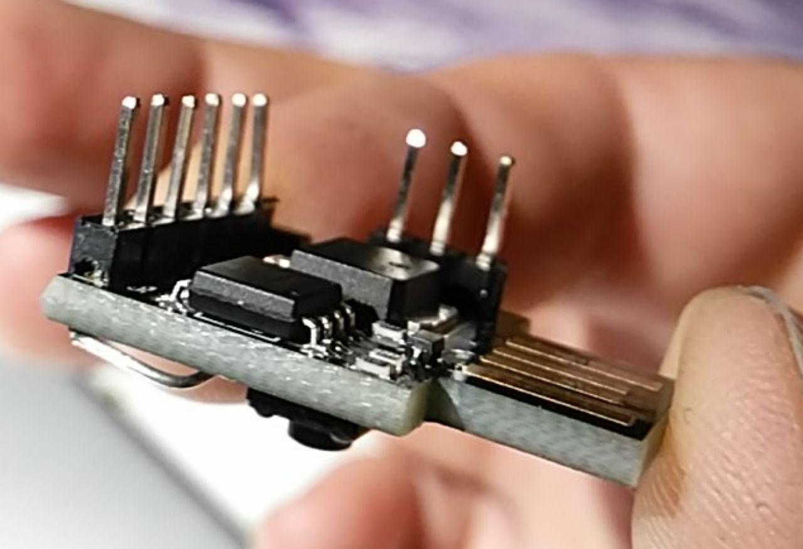

# Adafruit GemmaBoot on ordinary ATtiny85

You get ATtiny85 with usb connector as very cheap module on aliexpress.
To programm that thing without a programmer you need to burn a (small)
bootloader. After burning it, pressing reset (GND to p5) starts the bootloader
and the attiny85 module will be a usb device. You are able to burn
code via Arduino IDE by selecting **Adafruit Trinket 8MHz** with **USBtinyISP**
as programmer.

I use **USBasp** to burn the bootloader and after that: I do not need the USBasp programmer anymore!

## important mods in my Makefile

    DEVICE = attiny85
    BOOTLOADER_ADDRESS_LV = 1480

    PROGRAMMER = -c usbasp -B 5
    FUSEOPT_t85        = -U efuse:w:0xFE:m -U hfuse:w:0xD5:m
    FUSEOPT_t85_PLL    = -U lfuse:w:0xF1:m $(FUSEOPT_t85)

## create bootloader, set fuses and flash

    make clean
    make
    make fuse_pll
    make flash_lv

## License

Written by Frank Zhao for Adafruit Industries, 2013! This code is heavily 
derived from USBaspLoader, but also from USBtiny, with USBtinyISP's settings.

Copyright (c) 2013 Adafruit Industries

All rights reserved.

GemmaBoot is free software: you can redistribute it and/or modify
it under the terms of the GNU Lesser General Public License as
published by the Free Software Foundation, either version 3 of
the License, or (at your option) any later version.

GemmaBoot is distributed in the hope that it will be useful,
but WITHOUT ANY WARRANTY; without even the implied warranty of
MERCHANTABILITY or FITNESS FOR A PARTICULAR PURPOSE.  See the
GNU Lesser General Public License for more details.

You should have received a copy of the GNU Lesser General Public
License along with GemmaBoot. If not, see
<http://www.gnu.org/licenses/>.
